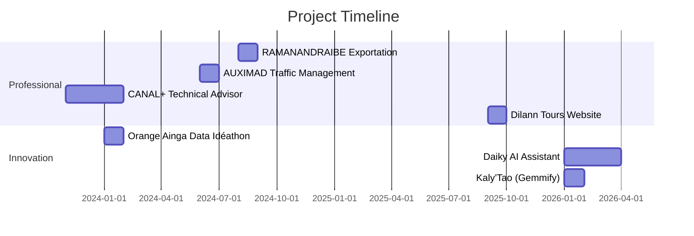

# Tiaheranto Mandaniana LALAHARIJAONA HERIARINIVO - Project Portfolio

## 📋 Project Overview

This document provides a comprehensive overview of all professional and personal projects developed by Tiaheranto Mandaniana LALAHARIJAONA HERIARINIVO. These projects showcase expertise in full-stack development, artificial intelligence, network security, and innovative problem-solving.

---

## 🏆 Award-Winning Project

### Orange Ainga Data Idéathon (2024)
**Prix coup de cœur - Orange Digital Center & IngeData**

- Innovative data-driven solution recognized for excellence
- Demonstrated ability to solve real-world problems using data science
- Competitive selection among participants

---

## 🚀 Professional Projects

### 1. Madagascar Dilann Tours Website (2025)
**Full Stack Development - Dilann Tours Madagascar**

A modern, responsive, and performant front-end website for a travel agency, showcasing tours and services with a clean UI/UX.

**Tech Stack:**
- Frontend: React 19
- Build Tool: Vite
- Language: TypeScript
- Styling: Tailwind CSS
- Package Manager: npm/yarn/pnpm

**Key Features:**
- ✅ Fully responsive design (desktop, tablet, mobile)
- ✅ Modern, intuitive user interface
- ✅ Type safety with TypeScript
- ✅ Lightning-fast development with Vite HMR
- ✅ Dynamic tour and service showcase
- ✅ Interactive elements (galleries, booking forms - planned)

**Links:**
- Repository: https://github.com/TiahMTeam/madagascar-dilann-tours.git

---

### 2. Raphia Transformation Platform (2024)
**Full Stack Development - RAMANANDRAIBE Exportation**

Comprehensive management and tracking platform for the transformation process from raw Raphia to finished products.

**Tech Stack:**
- Backend: Symfony (PHP)
- Database: MySQL

**Key Features:**
- ✅ End-to-end process tracking
- ✅ Production workflow management
- ✅ Quality control monitoring
- ✅ Inventory management
- ✅ Reporting and analytics

---

### 3. Network Traffic Management Application (2024)
**Network Development - AUXIMAD**

Application for network traffic management and prioritization with security features.

**Tech Stack:**
- Python
- Tkinter (GUI)
- Network analysis libraries

**Key Features:**
- ✅ Network traffic monitoring and analysis
- ✅ Traffic prioritization system
- ✅ Torrent blocking implementation
- ✅ Network flow filtering
- ✅ Real-time communication analysis
- ✅ User-friendly graphical interface

---

## 🤖 AI & Innovation Projects

### 4. Daiky - Local AI Assistant (2026)
**Personal Project**

A ChatGPT-like AI assistant running entirely locally using Gemma 4, designed for privacy-sensitive workflows and iterative experimentation.

**Tech Stack:**
- LLM: Gemma 4 (via Ollama)
- Backend: FastAPI (Python)
- Frontend: React + TypeScript
- Communication: Server-Sent Events (SSE)

**Key Features:**
- ✅ 100% local execution (no internet required)
- ✅ Real-time token-by-token streaming responses
- ✅ Multi-modal support (image upload & analysis)
- ✅ Temperature control (0.0–1.0)
- ✅ Dark/light theme toggle
- ✅ Session-based conversation history
- ✅ Type safety with TypeScript

**Development Focus:**
- Prompt engineering
- RAG (Retrieval-Augmented Generation) implementation (planned)
- Context handling optimization
- Knowledge retrieval systems

**Links:**
- Repository: (Private)

---

### 5. Kaly'Tao - AI-Powered Meal Planning (2026)
**Hackathon Project - Gemmify Madagascar**

Mobile application helping households plan realistic meals, track stock, budget, and nearby markets using AI.

**Tech Stack:**
- Backend: FastAPI, SQLAlchemy, SQLite, Pydantic v2
- Frontend: Expo SDK 54, React Native
- AI: Ollama (Gemma model) with Gemini API fallback
- Testing: Pytest

**Architecture:**

```
backend/
├── routers/          # HTTP endpoints
├── services/         # Business logic
├── models/           # Database models
├── schemas/          # JSON contracts
├── data/             # Seed data (recipes, markets)
└── logs/             # Tool call logging
```

**Key Features:**
- ✅ User onboarding (profile, household, preferences)
- ✅ Budget management and tracking
- ✅ Inventory/stock management
- ✅ Expiry alerts
- ✅ Nearby market finder
- ✅ AI-generated meal planning
- ✅ Recipe filtering (allergies, taboos, tags)
- ✅ Shopping list generation
- ✅ Gemma-powered chat assistant
- ✅ Tool-based execution (budget check, market finder, stock update)

**Core Services:**
- `recipe_rag`: Recipe filtering based on constraints
- `prompts`: Context building for Gemma
- `gemma_client`: Model interaction
- `gemma_agent`: Tool execution loop
- `planning_generation_service`: End-to-end planning workflow

**Key Routes:**
- `/onboarding`: Profile, household, preferences
- `/stock`: Inventory and expiry alerts
- `/budget`: Budget control
- `/market`: Points of sale and prices
- `/planning`: Meal planning and validation
- `/ia`: AI generation, chat, shopping guidance

**Development Philosophy:**
> "No invented prices, stock, or distances. All values pass through backend tools with logging."

**Links:**
- Repository: (Private)

---

## 🧩 Collaborative Projects

### 6. NovaPedia (2026)
**Collaborative Encyclopedia Web Application - Team Project (6 members)**

A three-tier collaborative encyclopedia web application offering a distinct reading experience per audience: Enfant (simplified content + interactive puzzle), Explorateur (detailed content + quiz), and Chercheur (full article-style pages with edit/delete entry points). Built with a crew of six, split across an independent React frontend and FastAPI backend.

**Tech Stack:**
- Frontend: React 19, TypeScript, Vite, TanStack Router, Tailwind CSS, Radix UI
- Backend: FastAPI, SQLAlchemy, PostgreSQL, JWT (python-jose), Argon2 password hashing

**Key Features:**
- ✅ Category-based encyclopedia navigation (enfant, explorateur, chercheur)
- ✅ Dynamic article pages by URL slug
- ✅ Text-to-speech buttons in several content areas
- ✅ Interactive puzzle mode for children
- ✅ Quiz mode for explorers
- ✅ Researcher-style full article view with edit/delete entry points
- ✅ Login/Register UI flow on the frontend
- ✅ Backend JWT auth endpoints (register, login)
- ✅ Backend CRUD for categories and articles

---

## 🛠️ Technical Competencies Demonstrated

### Backend Development
- FastAPI, Symfony, Express
- RESTful API design
- Database management (MySQL, SQLite)
- Authentication & authorization
- Server-Sent Events (SSE)

### Frontend Development
- React, React Native
- TypeScript, JavaScript
- Tailwind CSS, CSS
- Expo framework
- Responsive design

### AI & Machine Learning
- Local LLM deployment (Ollama)
- Prompt engineering
- RAG implementation
- Multi-modal AI (image analysis)
- Tool-based AI agents
- Context window optimization

### Cybersecurity & Networking
- Network traffic analysis
- Traffic filtering & blocking
- System hardening
- Network security monitoring

### DevOps
- Docker containerization
- VPS management
- Nginx web server
- Virtualization (VMware, VirtualBox)

---

## 📊 Project Timeline



---

## 🎯 Skills Matrix

| Skill Area | Proficiency | Demonstrated In |
|------------|-------------|-----------------|
| **AI/ML** | Intermediate | Daiky, Kaly'Tao |
| **Full Stack** | Advanced | Dilann Tours, RAMANANDRAIBE |
| **Cybersecurity** | Intermediate | AUXIMAD, Academic |
| **Network Admin** | Advanced | AUXIMAD, Academic |
| **System Admin** | Advanced | Professional Experience |
| **Mobile Dev** | Intermediate | Kaly'Tao |
| **DevOps** | Intermediate | Docker, VPS Management |

---

## 🌟 Key Achievements

1. **Prix coup de cœur** - Orange Ainga Data Idéathon 2024
2. **Successful full-stack deployments** for 3 commercial projects
3. **AI innovation** with local LLM deployment (Daiky)
4. **Hackathon participation** at Gemmify Madagascar
5. **Network security implementation** for traffic management

---

## 🔮 Future Development Directions

### Daiky Evolution
- RAG implementation for enhanced knowledge retrieval
- Advanced prompt engineering techniques
- Multi-model support
- Persistent conversation memory

### Kaly'Tao Expansion
- Market price integration
- Advanced recipe recommendations
- User behavior learning
- Multi-user household support

### Professional Growth
- AI infrastructure security
- Connected objects integration
- Cybersecurity for IoT
- Data-driven decision systems

---

## 📫 Contact Information

- **Email:** mandaniatanitaheranto@gmail.com
- **Phone:** +261 34 91 160 56
- **Location:** Antananarivo, Madagascar

---

*This portfolio document is continuously updated as new projects and achievements are completed.*