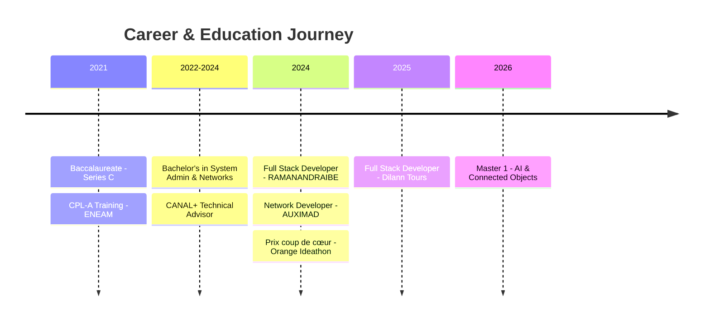

# Tiaheranto Mandaniana LALAHARIJAONA HERIARINIVO - Professional Profile

## 👤 Personal Information
- **Full Name:** Tiaheranto Mandaniana LALAHARIJAONA HERIARINIVO
- **Location:** 47 DF TER A Antonetibe llafy, Antananarivo, Madagascar
- **Phone:** +261 34 91 160 56
- **Email:** mandaniatanitaheranto@gmail.com

---

## 🎯 Professional Summary
Master's student in Computer Science (Artificial Intelligence specialization) at ENI Fianarantsoa with a strong foundation in network/security and rapidly developing expertise in AI and data science. Passionate about protecting systems through data security, combining infrastructure intelligence with resilience and decision-oriented approaches. Recent recipient of the "Prix coup de cœur" at the Orange Ainga Data Idéathon, organized by Orange Digital Center and IngeData.

---

## 🎓 Education

### ENI Fianarantsoa (2026 - Present)
**Master 1 - Computer Science**
- Specialization: Artificial Intelligence
- Track: Connected Objects & Cybersecurity

### E-media Madagascar – Nanisana, Antananarivo (2022 - 2024)
**Bachelor's Degree in System Administration and Networks**

### ENEAM - Ivato, Antananarivo (2021)
**Theoretical Training in Aircraft Piloting (CPL - A)**

### Ny Sekolintsika – Analamahitsy, Antananarivo (2020)
**Baccalaureate – Series C (Scientific)**

---

## 💻 Technical Competencies

### Cybersecurity & Network
- TCP/IP, DNS, DHCP
- Network Security & VLANs
- System Hardening
- Routing
- Security Monitoring & Filtering

### System Administration
- Linux Administration (Debian/Ubuntu)
- Docker & Containerization
- Virtualization (VMware, VirtualBox)
- VPS Management
- Nginx Web Server
- Bash Scripting

### Programming & Development
- **Languages:** Python, JavaScript, TypeScript, PHP, C
- **Frameworks & Tools:** Symfony, React, Express
- **Databases:** MySQL
- **Security Tools:** Kali Linux, Tails

---

## 💼 Professional Experience

### RAMANANDRAIBE Exportation – Soavinandriana, Itasy (August 2024)
**Full Stack Developer**
- Developed a comprehensive management and tracking platform for the transformation process from raw Raphia to finished products
- Technologies: Symfony + MySQL

### Dilann Tours Madagascar – Soavimbahoaka, Antananarivo (September 2025)
**Full Stack Developer**
- Developed the agency's official website
- Technologies: React + Express

### AUXIMAD – Antsahavola, Antananarivo (June 2024)
**Network Development & Security**
- Developed a network traffic management and prioritization application
- Implemented network flow filtering (Torrent blocking)
- Conducted network communication analysis
- Development in Python/Tkinter

### CANAL+ International (November 2023 - February 2024)
**Client Technical Advisor**
- Client management and technical support
- Served clients from Caribbean and Réunion Island regions

---

## 🏆 Awards & Recognition

### Orange Ainga Data Idéathon (july 2026)
**Prix coup de cœur**
- Organized by Orange Digital Center and IngeData
- Recognition for innovative data-driven solution

---

## 🌐 Languages

| Language | Proficiency |
|----------|-------------|
| Malagasy | Native |
| French | Very Good |
| English | Very Good |

---

## 🔍 Areas of Interest & Expertise

- **Artificial Intelligence & Machine Learning**
  - Data-driven decision making
  - AI infrastructure security
  - Data protection and privacy

- **Cybersecurity**
  - Network security architecture
  - System hardening
  - Security monitoring

- **Connected Objects & IoT**
  - Smart infrastructure
  - IoT security
  - Real-time data processing

---

## 🎯 Professional Philosophy

> "Protecting a system means protecting what it produces: data. Today, I combine these two perspectives to build intelligent, resilient, and decision-oriented infrastructures."

---

## 📊 Professional Growth Timeline

---

## 🔗 Professional Keywords

#ArtificialIntelligence #Cybersecurity #NetworkSecurity #FullStackDevelopment #DataProtection #IoT #SystemAdministration #Python #Linux #Docker #React #Symfony #MachineLearning #ConnectedObjects #DigitalTransformation #Innovation